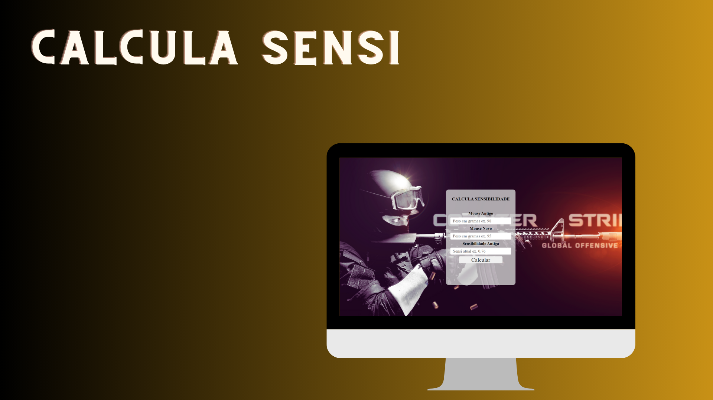

# Projeto-Calcula-Sensi
 

Neste projeto foi desenvolvido uma calculadora para ajuda na escolha da sensibilidade após a troca do seu mouse. 

  <a href="#-tecnologias">Tecnologias</a>&nbsp;&nbsp;&nbsp;|&nbsp;&nbsp;&nbsp;
  <a href="#-projeto">Projeto</a>&nbsp;&nbsp;&nbsp;|&nbsp;&nbsp;&nbsp;
  <a href="#memo-licença">Licença</a>

  

 

  

## 🚀 Tecnologias

Esse projeto foi desenvolvido com as seguintes tecnologias:

- HTML e CSS
- Javascript
- Git e Github

## 💻 Projeto

O projeto e uma calculadora para ajudar a escolher a melhor sensibilidade.

- [Acesse o projeto finalizado, online](https://vianahdev.github.io/Projeto-Calcula-Sensi/)

## :memo: Licença

Esse projeto está sob a licença MIT.